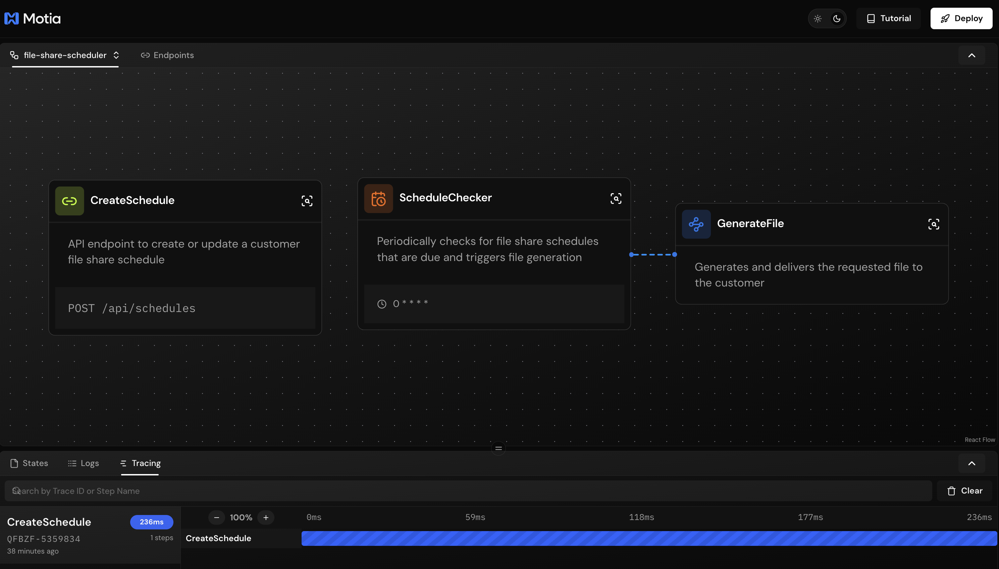

# Dynamic File Share Scheduler

A demonstration of dynamic cron scheduling using Motia's **State + Cron + API** pattern. Create unlimited customer schedules without manually creating cron steps.

## The Problem

You have customers requesting scheduled file shares, each with different schedules:
- Customer A: Products Excel file every **first Monday of the month**
- Customer B: Products Excel file **every week**
- Customer C: Daily reports with custom timezone

Traditional solution: Create a separate cron step for each customer → Maintenance nightmare!

## The Solution



Use **one** cron step for **all** customers by storing schedules in state:

```
API Request → Store in State → Cron Checks State → Execute When Due
```

## Learn More

This pattern is used in production by Motia's own [email-marketing-automation](https://github.com/motiadev/motia-examples/tree/main/examples/email-marketing-automation) example. Check it out for a more complex implementation!

## Quick Start

```bash
# Install dependencies
npm install

# Start server
npm run dev

# Server runs on http://localhost:3000
```

## Create a Schedule

### Weekly Schedule

```bash
curl -X POST http://localhost:3000/api/schedules \
  -H "Content-Type: application/json" \
  -d '{
    "customerId": "customer-001",
    "customerEmail": "customer@example.com",
    "scheduleType": "weekly",
    "config": {
      "dayOfWeek": "monday",
      "time": "09:00"
    },
    "timezone": "America/New_York",
    "fileType": "products",
    "format": "excel"
  }'
```

### First Monday of Month

```bash
curl -X POST http://localhost:3000/api/schedules \
  -H "Content-Type: application/json" \
  -d '{
    "customerId": "customer-002",
    "customerEmail": "customer2@example.com",
    "scheduleType": "monthly-first-weekday",
    "config": {
      "dayOfWeek": "monday",
      "time": "10:00"
    },
    "timezone": "Europe/London",
    "fileType": "products",
    "format": "pdf"
  }'
```

### Daily Schedule

```bash
curl -X POST http://localhost:3000/api/schedules \
  -H "Content-Type: application/json" \
  -d '{
    "customerId": "customer-003",
    "customerEmail": "customer3@example.com",
    "scheduleType": "daily",
    "config": {
      "time": "08:00"
    },
    "timezone": "Asia/Tokyo",
    "fileType": "products",
    "format": "csv"
  }'
```

### Custom Cron Expression

```bash
curl -X POST http://localhost:3000/api/schedules \
  -H "Content-Type: application/json" \
  -d '{
    "customerId": "customer-004",
    "customerEmail": "customer4@example.com",
    "scheduleType": "custom",
    "config": {
      "cronExpression": "0 */6 * * *"
    },
    "timezone": "UTC",
    "fileType": "products",
    "format": "excel"
  }'
```

## Schedule Types

| Type | Description | Config Example |
|------|-------------|----------------|
| `daily` | Every day at specified time | `{ "time": "09:00" }` |
| `weekly` | Specific day each week | `{ "dayOfWeek": "monday", "time": "09:00" }` |
| `monthly-first-weekday` | First Monday/Tuesday/etc | `{ "dayOfWeek": "monday", "time": "10:00" }` |
| `monthly-last-weekday` | Last Friday/etc | `{ "dayOfWeek": "friday", "time": "15:00" }` |
| `custom` | Custom cron expression | `{ "cronExpression": "0 */6 * * *" }` |

## How It Works

### Architecture

```
┌─────────────┐
│   Customer  │
│   Request   │
└──────┬──────┘
       │ POST /api/schedules
       ▼
┌─────────────────┐
│  API Step       │
│  Store in State │
└──────┬──────────┘
       │
       ▼
┌─────────────────┐     ┌─────────────────┐
│  Cron Step      │────▶│  Check if Due   │
│  (Every Hour)   │     │  emit events    │
└─────────────────┘     └────────┬────────┘
                                 │
                                 ▼
                        ┌─────────────────┐
                        │  Generate File  │
                        │  Deliver File   │
                        └─────────────────┘
```

### The Three Steps

1. **`01-create-schedule.step.ts`** (API)
   - Receives schedule creation requests
   - Validates input with Zod schema
   - Calculates next run time
   - Stores schedule in state

2. **`02-schedule-checker.step.ts`** (Cron - runs every hour)
   - Fetches all schedules from state
   - Checks which are due
   - Emits `file.generate` events for due schedules
   - Updates `nextRun` times

3. **`03-generate-file.step.ts`** (Event)
   - Listens to `file.generate` events
   - Generates requested file
   - Delivers via email/storage
   - Logs execution

## State Structure

```typescript
{
  scheduleId: string;              // Unique identifier
  customerId: string;              // Customer ID
  customerEmail: string;           // Delivery email
  scheduleType: string;            // Type of schedule
  nextRun: string;                 // ISO timestamp
  lastRun?: string;                // Last execution time
  timezone: string;                // Customer timezone
  fileType: string;                // Type of file to generate
  format: "excel" | "csv" | "pdf"; // File format
  status: "active" | "paused" | "failed";
  config: {
    dayOfWeek?: string;            // For weekly schedules
    time?: string;                 // HH:MM format
    cronExpression?: string;       // For custom schedules
  };
  executionCount: number;          // Track executions
}
```

## Cron Frequency

The checker runs every hour by default. Adjust in `02-schedule-checker.step.ts`:

```typescript
export const config = {
  type: "cron",
  cron: "0 * * * *",     // Every hour
  // cron: "*/5 * * * *", // Every 5 minutes
  // cron: "*/30 * * * *", // Every 30 minutes
}
```

## Benefits

✅ **Infinite Scalability** - Handle unlimited customers  
✅ **Zero Deployments** - Add schedules via API  
✅ **Flexible** - Multiple schedule types  
✅ **Customer Control** - Self-service scheduling  
✅ **Auditable** - Full execution history  
✅ **Maintainable** - 3 files vs 100s of cron files  

## Comparison: Traditional vs Dynamic

### Traditional Approach (Not Scalable)
```
steps/
  customer-001-cron.step.ts  # 100s of files
  customer-002-cron.step.ts
  customer-003-cron.step.ts
  ...
```
- ❌ New file per customer
- ❌ Deployment for each change
- ❌ Hard to maintain

### Dynamic Approach (Scalable)
```
steps/
  01-create-schedule.step.ts  # 3 files total
  02-schedule-checker.step.ts
  03-generate-file.step.ts
```
- ✅ Unlimited customers
- ✅ Changes via API
- ✅ Easy to maintain

## Customization

### Change File Generation Logic

Edit `03-generate-file.step.ts`:

```typescript
async function generateFile(fileType, format, customerId) {
  // Replace with your logic:
  // - Fetch data from your database
  // - Generate Excel: use ExcelJS
  // - Generate CSV: use csv-writer
  // - Generate PDF: use pdfkit
  
  return {
    fileName: `${fileType}-${customerId}-${date}.${format}`,
    data: yourData
  };
}
```

### Change Delivery Method

Edit `03-generate-file.step.ts`:

```typescript
async function deliverFile(fileData, email, customerId, logger) {
  // Options:
  // 1. Email: SendGrid, Mailgun
  // 2. Storage: S3, Google Cloud Storage
  // 3. Webhook: POST to customer URL
  // 4. FTP/SFTP upload
}
```

## Performance

- **100 schedules**: < 5 seconds per check
- **1,000 schedules**: < 30 seconds per check
- **10,000+ schedules**: Consider partitioning or queue system

## Real-World Use Cases

This pattern is perfect for:
- 📊 Scheduled report generation
- 📧 Email campaign scheduling
- 🔄 Data sync automation
- 📦 Inventory update schedules
- 📱 Notification delivery timing

## Learn More

This pattern is used in production by Motia's own [email-marketing-automation](https://github.com/motiadev/motia/tree/main/examples/email-marketing-automation) example. Check it out for a more complex implementation!
